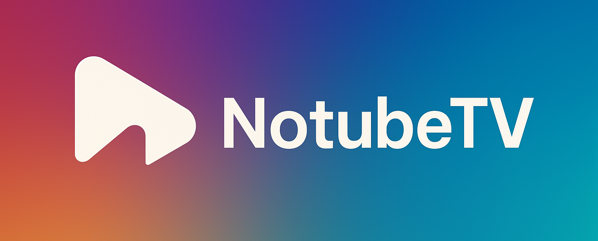

# NoTubeTV

  

This project owes it's existence to <a href="https://github.com/reisxd/TizenTube">@reisxd/TizenTube</a>. 

## • Installation

## Features

* YouTube Leanback UI.
* Unlocks 4K resolutions.
* Adblock, SponsorBlock, DeArrow.
* Disable `shorts` and more...

## Contributing

You can help by creating new issues or directly contributing to the development. 
For developers, please follow these guidelines:
1.  Fork the repository.
2.  Create a new branch for your feature or bug fix.
3.  Submit a pull request explaining your changes.
